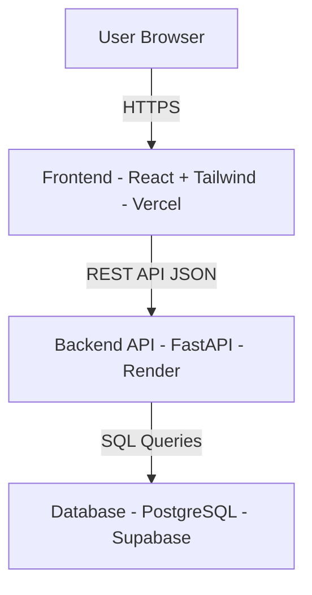

# System Architecture

## Overview
The Task Management MVP follows a three-tier architecture: frontend, backend API, and database.

## High-Level System Diagram

## Components

### Frontend
- Built with React and Tailwind CSS
- Communicates with backend via REST API calls
- Handles routing, state management, and UI rendering
- Deployed on Vercel

### Backend API
- Built with FastAPI (Python)
- Handles authentication, authorization, and task CRUD operations
- Issues and validates JWT tokens for secure access
- Deployed on Render

### Database
- PostgreSQL hosted on Supabase
- Stores all users, tasks, and categories
- Accessed only by the backend API layer

## Data Flow
1. User interacts with the React frontend in the browser
2. Frontend sends HTTP requests to the FastAPI backend
3. Backend validates the JWT token and processes the request
4. Backend queries PostgreSQL and retrieves or updates data
5. Response is returned as JSON to the frontend and rendered
